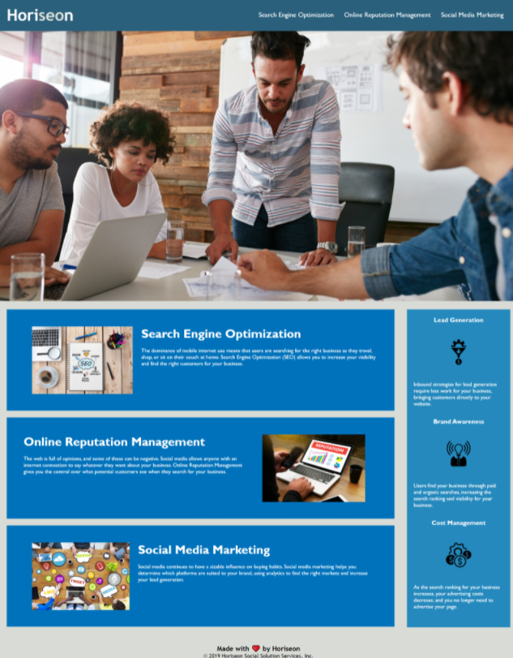

# Accessibility & Search Engine Optimization Challenge (10/17/21)
## Overview
The purpose of this project was to refactor index.html and style.css for an already working site with the objective of making the web page meet accessibility standards and optimized to be more easily accessed by search engines. 
## Changes to original code include 
- Changing of generic HTML elements to semantic elements 
- Organization of some HTML elements to flow more logically
- Adding id tags where necessary for functional nav links
- Consolidation of CSS 
- Adding or removing of CSS styles to fit new HTML elements and classes
- Adding comments to CSS to style sheet

Site deployed at [seo-challenge](https://aucoats.github.io/seo-challenge/)

## Deployed Site Image
